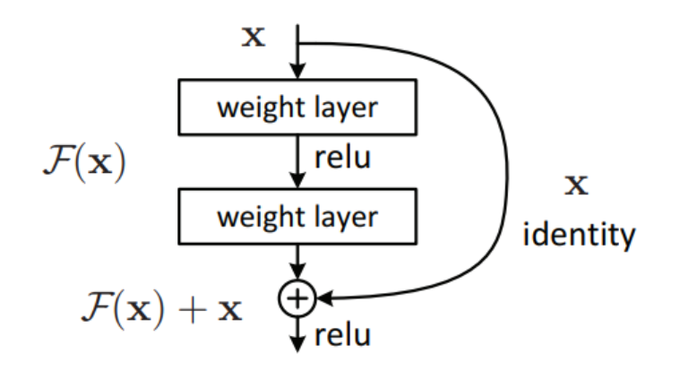

Implementation of [ResNet](https://arxiv.org/pdf/1512.03385) using PyTorch.This project includes the code for training and deployment on HuggingFace spaces using gradio.

## DATASET 
The data set used for training and testing is the [Brain Tumor MRI Dataset](https://www.kaggle.com/datasets/masoudnickparvar/brain-tumor-mri-dataset) from Kaggle.

## RESNET
ResNet was proposed in  2015 by researchers at Microsoft Research . The specialty of the model is its skip connection  or the residual blocks with which deep Neural Networks can be made without the problem of vanishing gradiant.The skip connection connects activations from one layer to later layers by skipping some layers in between.
***

## Hugging Face
The project is hosted on Hugging Face Spaces.Hugging Face is an open-source AI platform providing pre-trained models, datasets, and tools for NLP, computer vision, and machine learning.Hugging Face Spaces is a cloud-based platform for hosting AI demos and applications

## ONNX
ONNX (Open Neural Network Exchange) is an open standard that enhances model interoperability, optimizes performance with hardware acceleration, and enables seamless deployment across diverse platforms, including cloud, edge, and mobile devices. It streamlines AI workflows by bridging frameworks like PyTorch and TensorFlow, ensuring faster inference and efficient execution

Number of test samples : 1311
Accuracy:0.9611
Precision:0.9617
Recall:0.9611
F1 score:0.9607

## Per-Class Metrics 
glioma: Precision=0.9897, Recall=0.9633, F1-Score=0.9764
meningioma: Precision=0.9509, Recall=0.8856, F1-Score=0.9171
notumor: Precision=0.9332, Recall=1.0000, F1-Score=0.9654
pituitary: Precision=0.9833, Recall=0.9833, F1-Score=0.9833

